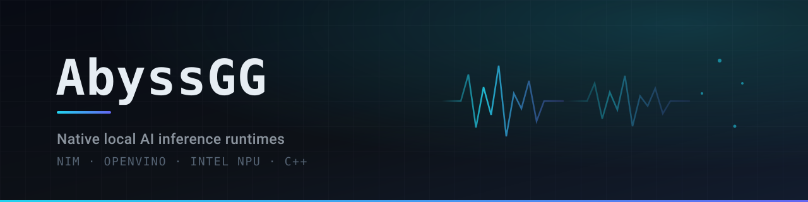

  <picture>
    <source media="(prefers-color-scheme: dark)" srcset="./assets/header-dark.svg">
    <source media="(prefers-color-scheme: light)" srcset="./assets/header-light.svg">
    
  </picture>

  

    <a href="https://isvik.org/">Isvik project</a> ·
    <a href="https://github.com/AbyssGG/Isvik">Inference runtime</a> ·
    <a href="https://github.com/AbyssGG?tab=repositories">All repositories</a>
  

I build native software for local AI on Intel PCs: OpenVINO bindings, inference runtimes, and offline applications in Nim and C++. Model inference stays on-device, with no Python runtime in the deployed path.

## Projects

- **[OpenVINO-Nim-API](https://github.com/AbyssGG/OpenVINO-Nim-API)** — community-maintained Nim bindings for the OpenVINO Runtime C API, with managed and header-faithful raw layers.
- **[Isvik](https://github.com/AbyssGG/Isvik)** — local inference runtime for Intel AI PCs, built in Nim on OpenVINO, with local OpenAI- and Anthropic-compatible API endpoints.
- **[Resonance](https://github.com/AbyssGG/Resonance)** — Nim bindings for the OpenVINO C API and the shared runtime layer behind Isvik and NimVoice.
- **[NimVoice](https://github.com/AbyssGG/NimVoice)** — offline text-to-speech for Windows AI PCs, built with Nim and OpenVINO, with Intel NPU acceleration.
- **[Candlelight](https://github.com/AbyssGG/Candlelight)** — offline Windows security app with file scanning, behavior monitoring, and local LLM explanations for alerts.

## Tech stack

  
  
  
  

Core project stack: Nim + OpenVINO · C++ is used in Candlelight.

Additional technologies

Low-level &amp; architecture

  
  
  
  
  

Platforms &amp; deployment

  
  
  
  
  
  

AI, inference &amp; acceleration

  
  
  
  

Languages &amp; runtimes

  
  
  
  
  
  

Web &amp; UI

  
  
  
  
  
  
  

Databases

  
  
  

## Contact

- **Email:** [ww809853@gmail.com](mailto:ww809853@gmail.com)
- **Work email:** [admin@isvik.org](mailto:admin@isvik.org)
- **LinkedIn:** [Profile](https://www.linkedin.com/in/%E4%BC%9F%E6%9D%B0-%E7%8E%8B-b39b5443a/)
- **X:** [@Pension_qe](https://x.com/Pension_qe)
- **YouTube:** [@Pension_qe](https://www.youtube.com/@Pension_qe)
- **Bilibili:** [Profile](https://space.bilibili.com/310843881)

